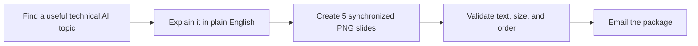

<div align="center">

# vipinislearning AI Carousel Automator

### Technical AI explained simply — delivered to your inbox automatically.

[](https://github.com/vipinvishal/Auto-carousel-agent/actions/workflows/carousel.yml)
[](assets/approved/reference-carousel/slide-01.png)
[](config/brand.json)

</div>

<p align="center">
  
</p>

<p align="center"><em>The approved visual direction: bold hook, simple diagram, useful takeaway, blue bird, and a clear CTA.</em></p>

The permanent visual reference library is kept in
[`assets/approved/reference-style/`](assets/approved/reference-style/). It is a
copied, version-controlled backup of the owner's `Ref Image` directory, so
future changes can be checked against the agreed hand-drawn look.

## What this project does

This project creates a complete Threads post for `vipinislearning` and emails
it to:

> `vipinislearning@gmail.com`

You do not need to keep your computer switched on. GitHub Actions runs the
automation in the cloud.

## Delivery schedule

| India time | What happens |
|---|---|
| 9:00 AM IST | Researched topic in Ref Image template |
| 12:00 PM IST | Researched topic in Ref Image template |
| 5:00 PM IST | Researched topic in Ref Image template |

GitHub uses UTC internally, so the workflow uses `03:30`, `06:30`, and `11:30`
UTC for these three India-time deliveries.

> GitHub may occasionally start a scheduled job a little late during heavy
> platform load.

## How one email is made



The post and the carousel are created together. The hook, explanation, and
takeaway are never generated as separate stories.

## What arrives in the email

Every email contains:

- `post.txt` — exactly three short Threads lines.
- `slide-01.png` to `slide-05.png` — five portrait PNGs in posting order.
- Hashtags on the third post line.
- A source note and package metadata.

The slides use the approved visual language:

- Cream paper background.
- Thick black handwritten-style type.
- Yellow hook highlights.
- Purple, mint, blue, orange, and pink cards.
- Simple technical diagrams and icons.
- Blue bird mascot.
- Pink takeaway banner and black CTA panel.

## Topics we publish

The content stays technical and beginner-friendly. Examples include:

- LLM behavior and model comparisons.
- New model or provider releases.
- RAG, embeddings, chunking, and retrieval.
- Prompting mechanics and output control.
- AI agents, tools, orchestration, and guardrails.
- Evaluation, latency, cost, privacy, and deployment.

For model releases, the content focuses on task fit and trade-offs—not a
permanent “best model” claim. Current claims are tied to research sources and
dated comparisons.

## Image behavior: reusable reference template

The eight-image Ref Image library is stored in
`assets/approved/reference-style/` and is the permanent visual source of truth.
The renderer reuses its rules for every new topic: handwritten marker text,
rough brush highlights, pastel cards, doodle icons, blue bird mascot, and
high-contrast CTA blocks.

For a golden visual test, the approved LLM reference carousel is stored in
`assets/approved/reference-carousel/` and can be sent unchanged with
`topic=llm` and `test_fallback=true`. This test path is intentionally separate
from scheduled delivery, because a static raster cannot carry a new topic's
content without breaking synchronization.

## Run a safe local test

From the repository root:

```bash
python3 -m pip install -r requirements.txt
python3 -m unittest discover -s tests
python3 src/automation.py --date 2099-01-01 --slot 0900 --topic llm --force-fallback
```

The generated package is written to `out/`. It contains the five PNGs, the
three-line post, and metadata. The `out/` directory is ignored by Git.

## Send a real test email

Open the **Actions** tab and run **vipinislearning approved AI Threads
carousel** manually with:

1. Any delivery slot.
2. `topic = llm`.
3. `test_fallback = true`.

This sends the exact approved five-slide reference carousel to the configured
Gmail address without waiting for live research or the content API. To preview
the reusable Ref Image template with a topic, run it with `test_fallback=false`
and choose `topic=agents`, `rag`, `prompting`, or `llm`.

## Required GitHub secrets

These secrets are configured in the repository and are never committed:

| Secret | Used for |
|---|---|
| `GMAIL_APP_PASSWORD` | Sends the email through Gmail SMTP |
| `GROQ_API_KEY` | Generates researched technical-AI copy |

If the content API is unavailable, the approved evergreen fallback keeps the
email pipeline working.

## Repository map

```text
src/automation.py       Build, validate, and send one package
src/research.py         Find and rank recent technical AI topics
src/content_engine.py   Create synchronized three-line copy and slide copy
src/renderer.py          Render the approved five-slide visual system
src/emailer.py           Attach PNGs and send the Gmail message
assets/approved/         Mascot and approved reference carousel
assets/approved/reference-style/
                         Permanent visual reference library
config/                  Brand, editorial, and LLM comparison rules
tests/                   Renderer, schedule, asset, and validation checks
```

## Design promise

Every delivery should make one technical AI idea easier to understand in under
a minute—and useful enough to save, share, or discuss.
