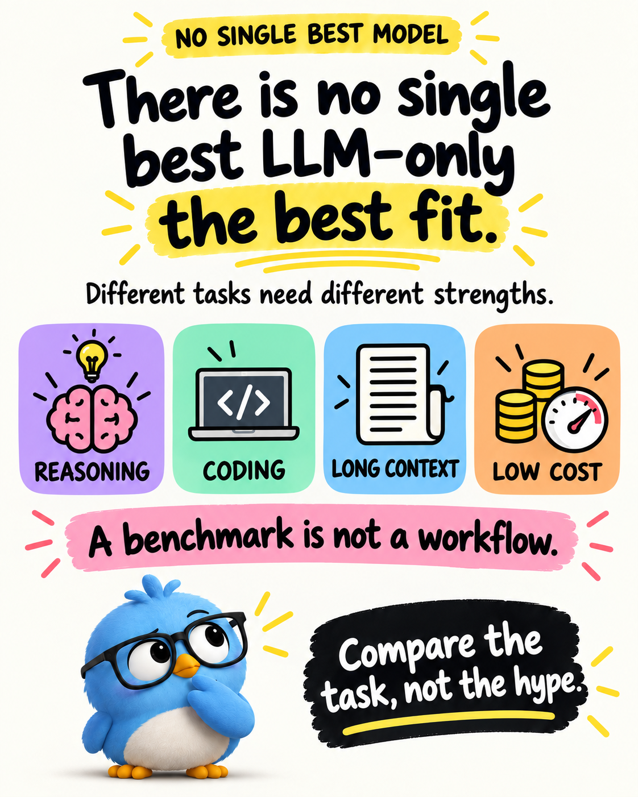
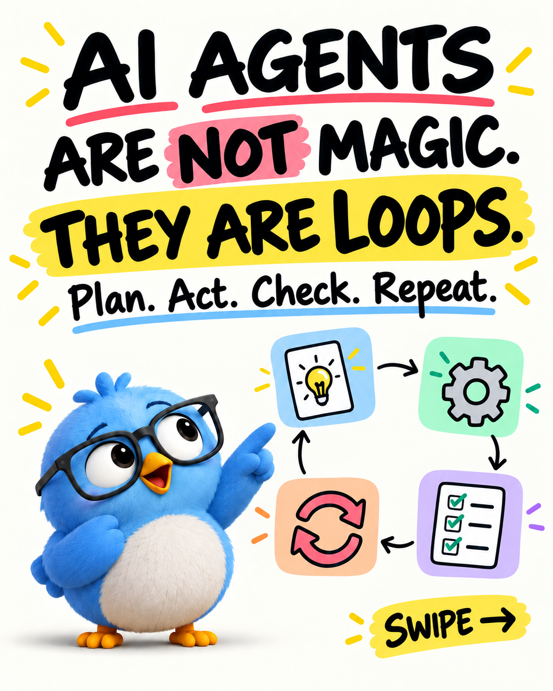
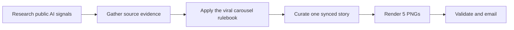

<div align="center">

# vipinislearning AI Carousel Automator

### Technical AI explained simply — delivered to your inbox automatically.

[](https://github.com/vipinvishal/Auto-carousel-agent/actions/workflows/carousel.yml)
[](assets/approved/reference-carousel/slide-01.png)
[](config/brand.json)

</div>

<p align="center">
  
</p>

<p align="center"><em>The approved visual direction: bold hook, simple diagram, useful takeaway, blue bird, and a clear CTA.</em></p>

The permanent visual reference library is kept in
[`assets/approved/reference-style/`](assets/approved/reference-style/). It is a
copied, version-controlled backup of the owner's `Ref Image` directory, so
future changes can be checked against the agreed hand-drawn look.

<p align="center">
  
</p>

<p align="center"><em>Quality target produced by supplying the real Ref Image PNGs directly to the image model.</em></p>

## What this project does

This project creates a complete Threads post for `vipinislearning` and emails
it to:

> `vipinislearning@gmail.com`

You do not need to keep your computer switched on. GitHub Actions runs the
automation in the cloud.

## Delivery schedule

| India time | What happens |
|---|---|
| 9:00 AM IST | Fresh researched technical AI carousel |
| 12:00 PM IST | Fresh researched technical AI carousel |
| 5:00 PM IST | Fresh researched technical AI carousel |

GitHub uses UTC internally, so the workflow uses `03:30`, `06:30`, and `11:30`
UTC for these three India-time deliveries.

> GitHub may occasionally start a scheduled job a little late during heavy
> platform load.

## How one email is made



The scheduled job follows this exact order:

1. Search Exa for fresh, source-grounded technical AI evidence.
2. Add Hacker News, Reddit, and Google News as public engagement and recurrence signals.
3. Rank Exa-grounded topics by recency, technical relevance, source quality, and public signals.
4. Apply `config/viral_carousel_rules.json`, which encodes the approved local `viral-ai-carousel` skill: curiosity → tension → insight → payoff; one idea per slide; and a connected CTA.
5. Curate the three-line Threads post and five-slide story together.
6. Generate portrait PNGs with Gemini Image, supplying three approved Ref
   Image files as direct visual inputs for every slide.
7. Validate dimensions, file type, slide count, hashtags, source metadata, and synchronization before Gmail delivery.

“Viral” is treated honestly as a public-signal proxy. The workflow cannot see
private Threads or social-platform view counts, so it never pretends that a
story has the maximum views; it selects topics with fresh, repeated, and
engaged public attention instead.

## What arrives in the email

Every email contains:

- `post.txt` — exactly three short Threads lines.
- `slide-01.png` to `slide-05.png` — five portrait PNGs in posting order.
- Hashtags on the third post line.
- A source note and package metadata.

The slides use the approved visual language:

- Cream paper background.
- Thick black handwritten-style type.
- Yellow hook highlights.
- Purple, mint, blue, orange, and pink cards.
- Simple technical diagrams and icons.
- Blue bird mascot.
- Pink takeaway banner and black CTA panel.

## Topics we publish

The content stays technical and beginner-friendly. Examples include:

- LLM behavior and model comparisons.
- New model or provider releases.
- RAG, embeddings, chunking, and retrieval.
- Prompting mechanics and output control.
- AI agents, tools, orchestration, and guardrails.
- Evaluation, latency, cost, privacy, and deployment.

For model releases, the content focuses on task fit and trade-offs—not a
permanent “best model” claim. Current claims are tied to research sources and
dated comparisons.

## Image behavior: approved reference system

The eight-image Ref Image library is stored in
`assets/approved/reference-style/` and is the permanent visual source of truth.
Scheduled emails use this library's visual rules, so fresh content cannot
silently switch back to the old renderer style.

Scheduled fresh topics use the `ref-image-handwritten-v3-image-model`
pipeline. Gemini Image receives three real reference PNGs for every slide; it
does not redraw the artwork with Pillow. Its five layout prompts are
deliberately taken from the reference library:

1. Curiosity cover — oversized hook, one highlighted phrase, large mascot,
   compact doodle grid, and swipe cue.
2. Tension/mechanism — one four-part technical flow and a pink note.
3. Insight — one four-part flow and an outlined speech bubble.
4. Application — one four-part flow and a practical pink note.
5. Payoff — checklist, large mascot, connected save prompt, and the only black
   CTA panel in the carousel.

The locked specification is stored in
[`config/ref_image_template.json`](config/ref_image_template.json). It forbids
the retired sparse SaaS-card layout, tiny mascot, slide counter, dashboard
header, and repeated black CTA. New words and doodles change with the researched
topic; the visual grammar does not.

The retired Pillow renderer is available only for an explicit local developer
preview. Scheduled jobs never enable it. If reference-conditioned image
generation is unavailable, the workflow stops before Gmail delivery instead of
emailing a visually incorrect fallback.

The exact raster references remain available through the manual
`reference_lock=true` option. That mode copies the approved PNGs byte-for-byte
and is useful as a golden visual test; it is not used for scheduled fresh
topics because fixed words cannot explain a newly researched topic.

## Run a safe local test

From the repository root:

```bash
python3 -m pip install -r requirements.txt
python3 -m unittest discover -s tests
python3 src/automation.py --date 2099-01-01 --slot 0900 --topic agents --force-fallback --allow-pillow-preview
```

The generated package is written to `out/`. It contains the five PNGs, the
three-line post, and metadata. The `out/` directory is ignored by Git.

## Send a real test email

Open the **Actions** tab and run **vipinislearning approved AI Threads
carousel** manually with:

1. Any delivery slot.
2. `reference_lock = true` for an exact approved-image email, or leave it false
   and choose `topic=auto` to test live research, content generation, rendering,
   and Gmail delivery together.

The workflow emails only complete live packages to the configured Gmail
address. If live copy or image generation fails, it stops instead of sending a
generic or visually rejected fallback.

## Required GitHub secrets

These secrets must be configured in the repository and are never committed:

| Secret | Used for |
|---|---|
| `GMAIL_APP_PASSWORD` | Sends the email through Gmail SMTP |
| `OPENROUTER_API_KEY` | Uses `openrouter/free` to curate live researched technical-AI copy |
| `EXA_API_KEY` | Finds current, source-grounded technical-AI research before writing starts |
| `GEMINI_API_KEY` | Generates five reference-conditioned images; the workflow converts them to PNG attachments |

There is intentionally no low-quality fallback: a missing or failed live-copy
or image-model call stops the email.

## Repository map

```text
src/automation.py       Build, validate, and send one package
src/research.py         Find, rank, and gather recent technical AI topics
src/content_engine.py   Create synchronized three-line copy and slide copy
src/image_engine.py     Generate PNGs from direct Ref Image inputs
src/renderer.py          Developer-only deterministic preview and shared visual data
src/emailer.py           Attach PNGs and send the Gmail message
assets/approved/         Mascot and approved reference carousel
assets/approved/reference-style/
                         Permanent visual reference library
config/                  Brand, editorial, LLM, and viral-carousel rules
tests/                   Renderer, schedule, asset, and validation checks
```

## Design promise

Every delivery should make one technical AI idea easier to understand in under
a minute—and useful enough to save, share, or discuss.
